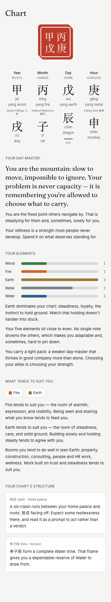

# Daymaster

A daily-reading app in the shape of Co-Star, with a different engine under the hood: **BaZi** (Chinese Four Pillars, 八字). Enter your birth date, time (or "I don't know"), city, and sex, and Daymaster computes your Four Pillars chart and gives you a natal reading, a daily reading driven by *real* computed interactions between today's pillar and your chart, and your 10-year luck-cycle timeline.

Everything runs on your device. No accounts, no server, no network calls — an installable PWA whose charts live in localStorage.

## Quickstart

Requirements: Node 20+, pnpm 9.

```sh
pnpm install
pnpm verify          # typecheck + lint + unit tests + build, all packages
pnpm --filter @daymaster/web dev    # dev server at localhost:3000
```

The production build is a static export:

```sh
pnpm --filter @daymaster/web build  # emits apps/web/out/
npx serve apps/web/out              # any static file server works
```

End-to-end smoke flows (Playwright):

```sh
pnpm --filter @daymaster/web e2e
```

## Architecture

```
apps/web              Next.js 15 (App Router, static export) + Tailwind. UI only:
                      no chart math, no reading prose. State = localStorage
                      (daymaster.profile.v1), read through one gateway module.
packages/bazi-engine  Pure TypeScript BaZi engine. Deps: luxon (IANA timezones)
                      + astronomy-engine (solar longitude). Every exported
                      function is pure and deterministic. Emits typed
                      ReadingFacts; owns ALL calendrical and chart math.
packages/content      Zero-dep line bank + deterministic seeded selection.
                      Turns ReadingFacts into voice-governed English. Does no
                      chart math — it phrases what the engine computed.
```

The engine computes facts; content phrases them; the web app renders both. Readings are seeded by `hash(birth data + ISO date)`, so the same person on the same day always sees the same reading.

- `DESIGN.md` — the ink & cinnabar design system (tokens, type, the seal).
- `packages/content/VOICE.md` — the copy contract every line obeys.
- `PLAN.md` / `PROGRESS.md` — build plan and evidence log.

## Engine doctrine

BaZi is a living tradition with multiple schools. This engine implements one documented reading of it; the interpretive choices are labeled in code and configurable where schools genuinely differ:

- **Year boundary** is the exact instant of 立春 (Li Chun) — not January 1, not Chinese New Year. **Month boundaries** are the 12 jié (节), the instants the sun's apparent ecliptic longitude crosses 315° + k·30°, computed with astronomy-engine and embedded as a 1900–2100 table (`packages/bazi-engine/data/solar-terms.json`). Dates outside 1900–2100 are rejected, never extrapolated.
- **Day pillar** is the continuous 60-day cycle anchored at 1949-10-01 = 甲子, flipping at local midnight by default. The **late Zi hour** (23:00–24:00) is configurable: `midnight` (default) keeps the same civil day; `shift-day` assigns the next day's pillar.
- **True solar time** (off by default): adjusts the birth instant by the birthplace's longitude offset from its timezone meridian plus the equation of time before computing day/hour pillars.
- **Luck pillars**: direction is forward for yang-year males and yin-year females, backward otherwise; start age = days to the nearest jié in the direction of travel ÷ 3 (3 days = 1 year, rounded to whole months) — one common school's rounding, documented in code.
- **Strength & favorable elements** are a simple documented heuristic (seasonal support + weighted supporter/drainer counts; climate-first favorables), labeled interpretive in the source. They drive tone, not verdicts.

Reference tables (stems, branches, hidden stems, ten gods, combines/clashes/trines/punishments/harms, Five Tigers, Five Rats) are embedded in `packages/bazi-engine/data/` with source comments. The engine's test suite includes golden fixtures with hand-derived expectations and is held at ≥90% line coverage.

City data comes from [GeoNames](https://www.geonames.org) (cities15000, CC BY 4.0), bundled offline — top 2,000 cities by population.

## Screenshot



## Disclaimer

Daymaster is for reflection and entertainment, not advice. BaZi has many schools; this app implements one, with its assumptions documented. Nothing here predicts your future or diagnoses anything about you.
