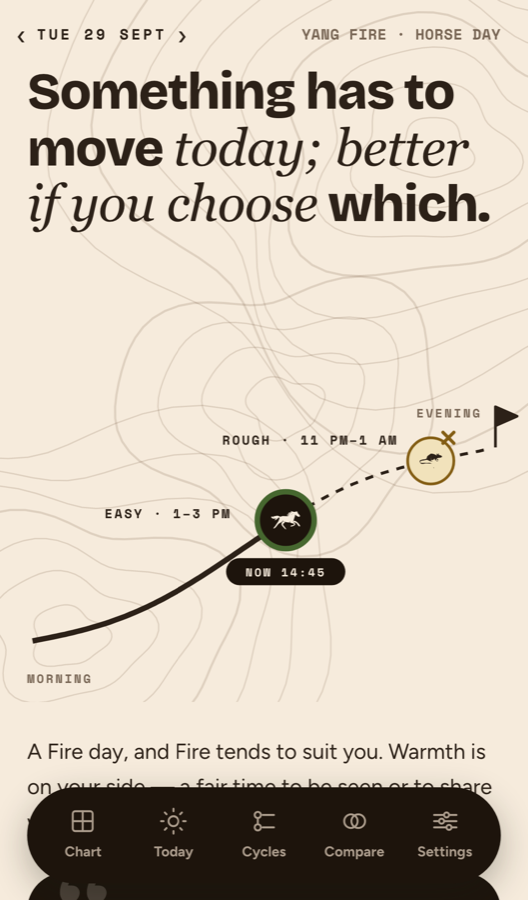
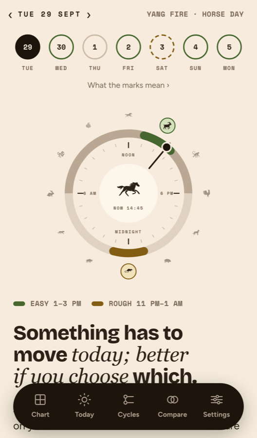

# Daymaster

A daily-reading app in the shape of Co-Star, with a different engine under the hood: **BaZi** (Chinese Four Pillars, 八字). Enter your birth date, time (or "I don't know"), city, and sex, and Daymaster computes your Four Pillars chart and gives you a natal reading, a daily reading driven by *real* computed interactions between today's pillar and your chart, your 10-year luck-cycle timeline, and a Compare screen that reads how a second person's chart meets yours.

Everything runs on your device. No accounts and no server — an installable PWA whose charts live in localStorage. Light and dark themes follow your device, or pin either in Settings.

Because there is no account, your data stays yours in the plainest way: Settings can edit your birth details in place, download a JSON backup (restorable from onboarding on a new device), and delete everything. Compare keeps a named list of saved people. Charts share two ways, both serverless: a card image drawn on-device, and a link that encodes the birth details so the recipient's device recomputes the identical chart. The service worker precaches the whole export — every screen works offline — and new deploys wait for a user-accepted refresh.

## What leaves your device

By default, nothing. Readings are computed on the device, and charts, people and notes stay in its storage.

A build can optionally send **anonymous usage counts** to an Umami-compatible tracker (cookieless, no identifiers): which screens and looks get used, and a fixed list of events whose fields are coarse buckets. Birth details, notes and error messages are never sent. It's off unless the build sets `NEXT_PUBLIC_ANALYTICS_SCRIPT_URL` and `NEXT_PUBLIC_ANALYTICS_SITE_ID` (plus `NEXT_PUBLIC_ANALYTICS_HOST_URL` if events go to a different origin) — for example in `apps/web/.env.production.local`. Readers can switch it off in Settings, and a browser sending Global Privacy Control or Do Not Track is never counted. The full event list is `UsageEvent` in `apps/web/src/lib/analytics.ts`; the design is [M19.8-06](.claude/specs/m19.8-foundations/06-usage-counts/design.md).

## Quickstart

Requirements: Node 20.12+, pnpm 9.

```sh
pnpm install
pnpm verify                          # typecheck + lint + unit tests + build, all packages
pnpm --filter @daymaster/web dev     # dev server at localhost:3000
```

The production build is a static export, plus the files a deploy needs:

```sh
pnpm --filter @daymaster/web build   # emits apps/web/out/: pages, sw.js, vercel.json
npx serve apps/web/out               # any static file server works (without the headers)
```

End-to-end flows (Playwright) run against that export, served with production's headers, and with a local stand-in for the usage-counts tracker:

```sh
pnpm --filter @daymaster/web e2e          # default look
pnpm --filter @daymaster/web e2e:looks    # once per look: Explorer, Editorial, Instrument
```

CI (`.github/workflows/verify.yml`) runs `pnpm verify` and the E2E suite in every look on each push to `main` and each pull request.

### Deploying

Production is https://daymaster-nu.vercel.app, deployed by hand from the built export (no deploy on push). Link inside `out/` first — `out/` is rebuilt every time, and deploying without a link there creates a stray Vercel project:

```sh
pnpm --filter @daymaster/web build
cd apps/web/out && npx vercel link --yes --project daymaster && npx vercel deploy --prod --yes
```

`out/vercel.json` (written by `scripts/write-deploy-config.mjs`) carries the security headers, including the CSP, and immutable caching for hashed assets.

## Architecture

```
apps/web                Next.js 15 (App Router, static export) + Tailwind. UI only:
                        no chart math, no reading prose. State = one versioned
                        localStorage document (daymaster.store.v2), read and written
                        through lib/store.ts. Three looks (Explorer, Editorial,
                        Instrument) on the same data. Optional, dormant-by-default
                        usage counts through lib/analytics.ts.
packages/bazi-engine    Pure TypeScript BaZi engine. Deps: luxon (IANA timezones)
                        + astronomy-engine (true solar time; the solar-term table is
                        precomputed). Every exported function is pure and
                        deterministic. Emits typed ReadingFacts; owns ALL
                        calendrical and chart math.
packages/content        Zero-dep line bank + deterministic seeded selection.
                        Turns ReadingFacts into voice-governed English. Does no
                        chart math — it phrases what the engine computed.
packages/presentation   View-models between engine/content and the screens: what
                        each screen shows, in what order, with what labels. Pure;
                        no React, no DOM.
```

The engine computes facts; content phrases them; presentation shapes them for a screen; the web app renders them. Readings are seeded by `hash(birth data + ISO date)`, so the same person on the same day always sees the same reading.

- `.claude/specs/foundation/DESIGN.md` — the design system: shared base plus the three looks.
- `.claude/specs/foundation/VOICE.md` — the copy contract every line obeys.
- `.claude/specs/` — how work is planned: milestones → tickets, each with requirements, design and tasks.
- `.claude/specs/decisions.md` — every decision, linked to the ticket that records it.

## Engine doctrine

BaZi is a living tradition with multiple schools. This engine implements one documented reading of it; the interpretive choices are labeled in code and configurable where schools genuinely differ:

- **Year boundary** is the exact instant of 立春 (Li Chun) — not January 1, not Chinese New Year. **Month boundaries** are the 12 jié (节), the instants the sun's apparent ecliptic longitude crosses 315° + k·30°, computed with astronomy-engine and embedded as a 1900–2100 table (`packages/bazi-engine/data/solar-terms.json`). Dates outside 1900–2100 are rejected, never extrapolated.
- **Day pillar** is the continuous 60-day cycle anchored at 1949-10-01 = 甲子, flipping at local midnight by default. The **late Zi hour** (23:00–24:00) is configurable: `midnight` (default) keeps the same civil day; `shift-day` assigns the next day's pillar.
- **True solar time** (off by default): adjusts the birth instant by the birthplace's longitude offset from its timezone meridian plus the equation of time before computing day/hour pillars.
- **Luck pillars**: direction is forward for yang-year males and yin-year females, backward otherwise; start age = days to the nearest jié in the direction of travel ÷ 3 (3 days = 1 year, rounded to whole months) — one common school's rounding, documented in code.
- **Strength & favorable elements** are a simple documented heuristic (seasonal support + weighted supporter/drainer counts; climate-first favorables), labeled interpretive in the source. They drive tone, not verdicts.

Reference tables (stems, branches, hidden stems, ten gods, combines/clashes/trines/punishments/harms, Five Tigers, Five Rats) are embedded in `packages/bazi-engine/data/` with source comments. The engine's test suite includes golden fixtures with hand-derived expectations and is held at ≥90% line coverage.

City data comes from [GeoNames](https://www.geonames.org) (cities15000, CC BY 4.0), bundled offline — top 2,000 cities by population.

## Screenshots

Today in the three looks — Explorer, Editorial, Instrument (Fixture A, 2026-09-29, light theme):

<p>
  
  
  
</p>

## Disclaimer

Daymaster is for reflection and entertainment, not advice. BaZi has many schools; this app implements one, with its assumptions documented. Nothing here predicts your future or diagnoses anything about you.
